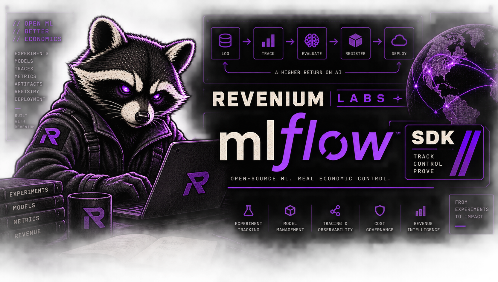

[](assets/mlflow-revenium-labs.png)

[](https://github.com/revenium/.github/blob/main/LABS.md) [](#status)

# Revenium MLflow SDK

Economic telemetry for MLflow-instrumented applications, supported by Revenium.

`revenium-mlflow` sends attribution, tool-metering, and job-outcome signals from an application that
already uses MLflow tracing to Revenium. It uses MLflow's public extension points, so you do not
need to fork or modify MLflow. The SDK also prevents the same model call, tool execution, or job
outcome from being counted twice. Traces stay in your MLflow Tracking Server as the engineering
record for tracing, evaluation, and experiments. Revenium is the rating source for their economics.

> ### 🧪 This is a Revenium Labs project
>
> **Revenium Labs** projects are field-developed, best-effort, beta-quality software shared in the open. They are **not** part of Revenium's officially supported products.
>
> * It may need adaptation for your environment.
> * It's provided as-is, without the versioned-release guarantees, SLAs, or formal support that back our core products.
> * Issues, feedback, and PRs are welcome. [Join us on Discord](https://discord.gg/J2DbmjZ2nA).
>
> → **[What is Revenium Labs?](https://github.com/revenium/.github/blob/main/LABS.md)**

> This is a Revenium project. It is **neither part of, nor endorsed by, the MLflow project.**
> MLflow is a trademark of its respective owners; this SDK is an independent integration built
> entirely on MLflow's public extension points.

## Who this is for

This SDK is for teams that already send MLflow traces to an MLflow Tracking Server and want Revenium
to calculate cost attribution, enforce spend controls, and report job ROI from those traces.

## Status

This project is in early development, before the beta stage used by most Revenium Labs projects.
The distribution is **not published to any package index** and is not released or production-ready.
Install it from a locally built artifact or the working tree.

## Install

Requires Python 3.10 or newer.

```bash
# From the working tree (editable, with the development extra)
uv venv --python 3.10 .venv
uv pip install --python .venv/bin/python -e ".[dev]"

# Or from a locally built wheel
.venv/bin/python -m build
uv pip install --python .venv/bin/python dist/revenium_mlflow-*.whl
```

Verify the install:

```bash
.venv/bin/python -c "import revenium_mlflow; print(revenium_mlflow.__version__)"
```

The captured transcript for the build, the clean-environment install, and the editable install is
committed at [`docs/verification/pkg-02-build-install.md`](docs/verification/pkg-02-build-install.md).

## Quickstart

The SDK attaches a second exporter to MLflow's existing tracer provider. Configure it once, after
MLflow tracing is enabled, then wrap traced work in an `attribution()` scope.

Set a metering key and a local OTLP/HTTP collector endpoint. Keep the key in the environment rather
than in source code. The fake value below is intentional.

```bash
export REVENIUM_METERING_API_KEY="rev_mk_FAKE"
export REVENIUM_OTLP_TRACES_ENDPOINT="http://127.0.0.1:4318/v1/traces"
```

`REVENIUM_METERING_API_KEY` is the same variable the other Revenium SDKs read, so a machine already
running one of them needs no second export.

To point at a non-production Revenium deployment, set the base URL instead of the full endpoint and
the SDK composes the OTLP traces route onto it — again the same variable the other Revenium SDKs
use:

```bash
export REVENIUM_METERING_BASE_URL="https://your-deployment.example.com"
# resolves to https://your-deployment.example.com/meter/v2/otlp/v1/traces
```

The endpoint resolves argument first, then `REVENIUM_OTLP_TRACES_ENDPOINT`, then
`REVENIUM_METERING_BASE_URL` composed, then the default `https://api.revenium.io/meter/v2/otlp/v1/traces`.
Setting `REVENIUM_METERING_BASE_URL` to something that is already a full `/v1/traces` endpoint
raises a `ConfigurationError` rather than composing a doubled suffix.

The SDK never reads or writes `OTEL_EXPORTER_OTLP_TRACES_ENDPOINT` or
`OTEL_EXPORTER_OTLP_TRACES_HEADERS`. Those are process-global and single-valued, and they belong to
your own collector configuration; the Revenium exporter carries its endpoint and its credential on
its own instance. Captured proof is in
[`docs/verification/cfg-03-env-untouched.md`](docs/verification/cfg-03-env-untouched.md).

### In an application, with MLflow autolog

This is the shape a real integration takes. The application makes its normal inference call and
sets no span attributes.

Requires the provider client library. It is not a dependency of this package.

```python
import os

import mlflow
import openai

from revenium_mlflow import attribution, configure_tracing

mlflow.openai.autolog()

handle = configure_tracing(
    api_key=os.environ["REVENIUM_METERING_API_KEY"],
    otlp_traces_endpoint=os.environ["REVENIUM_OTLP_TRACES_ENDPOINT"],
)

with attribution(
    organization_name="example-org",
    subscriber_id="example-subscriber",
):
    openai.OpenAI().chat.completions.create(
        model="gpt-4o",
        messages=[{"role": "user", "content": "Where is my order?"}],
    )

if not handle.flush(5.0):
    raise RuntimeError("Revenium export did not finish within five seconds")

mlflow.flush_trace_async_logging()
```

MLflow's autolog creates the `CHAT_MODEL` span and reads token counts from the provider response,
including the prompt-cache counts that Anthropic and Bedrock report
(`mlflow/anthropic/autolog.py`). MLflow ships autolog for `anthropic`, `autogen`, `bedrock`,
`crewai`, `dspy`, `gemini`, `groq`, `langchain`, `litellm`, `llama_index`, `mistral`, `openai`,
`pydantic_ai`, `semantic_kernel` and `smolagents`.

This block has no captured transcript in `docs/verification/`. Running it needs a provider
credential and a network call, which this repository does not make. Treat it as the documented
shape, not a verified one.

### Without a provider credential

The block below builds the same span shape by hand so the export path can be exercised with no
credentials. An application does not write these attributes; autolog writes them.

```python
import os

import mlflow

from revenium_mlflow import attribution, configure_tracing

handle = configure_tracing(
    api_key=os.environ["REVENIUM_METERING_API_KEY"],
    otlp_traces_endpoint=os.environ["REVENIUM_OTLP_TRACES_ENDPOINT"],
)

with attribution(
    organization_name="example-org",
    subscriber_id="example-subscriber",
):
    with mlflow.start_span(name="quickstart-chat", span_type="CHAT_MODEL") as span:
        span.set_attribute("mlflow.llm.model", "gpt-4o")
        span.set_attribute("mlflow.llm.provider", "openai")
        span.set_attribute(
            "mlflow.chat.tokenUsage",
            {"input_tokens": 10, "output_tokens": 5, "total_tokens": 15},
        )

if not handle.flush(5.0):
    raise RuntimeError("Revenium export did not finish within five seconds")

mlflow.flush_trace_async_logging()
```

In both cases MLflow still writes the trace to its configured Tracking Server. The Revenium
exporter sends the billable `CHAT_MODEL` span to the endpoint above with normalized `gen_ai.*`
fields and the `revenium.*` attribution from the active scope. Orchestration spans in the same
trace are not exported.

For a safe local proof using the repository's loopback collector, run:

```bash
.venv/bin/python -m pytest -q tests/unit/test_dual_export_gate.py
```

Do not call `configure_tracing()` twice in the same process. This early build does not yet detect
an existing installation, so a second call adds another exporter and sends every eligible span
twice. MLflow can also rebuild its tracer provider after configuration; `handle.is_active()` and
`handle.reinstall()` are not implemented yet.

## Typing

The distribution supports PEP 561. Its `py.typed` marker tells type checkers to use the package's
inline annotations, so no stub package is required.

## Requirements

| Dependency | Constraint | Why |
|---|---|---|
| Python | `>=3.10` | Lowest floor the whole dependency graph supports |
| `mlflow` | `>=3.15.0,<4` | First release exposing `mlflow.tracing.get_bridged_tracer_provider()`, the public `SpanProcessor` attachment point |
| `opentelemetry-api` / `-sdk` | `>=1.30.0,<2` | MLflow declares a `>=1.9.0` floor, but 1.9.0 requires `pkg_resources` and fails to import |
| `opentelemetry-exporter-otlp-proto-http` | `>=1.30.0,<2` | Revenium's ingest route is HTTP + protobuf; the gRPC exporter is deliberately not used |
| `revenium-python-sdk` | `>=0.7.0,<1` | Tool events, job outcomes, retry, and idempotency |
| `httpx` | `>=0.27,<1` | Direct Revenium HTTP calls |

## Documentation

See [`docs/`](docs/README.md) for the documentation index and [`examples/`](examples/README.md) for
runnable examples.

## Contributing

See [CONTRIBUTING.md](CONTRIBUTING.md). Send security reports to `support@revenium.io` and read
[SECURITY.md](SECURITY.md) before submitting one.

## License

MIT. See [LICENSE](LICENSE).
